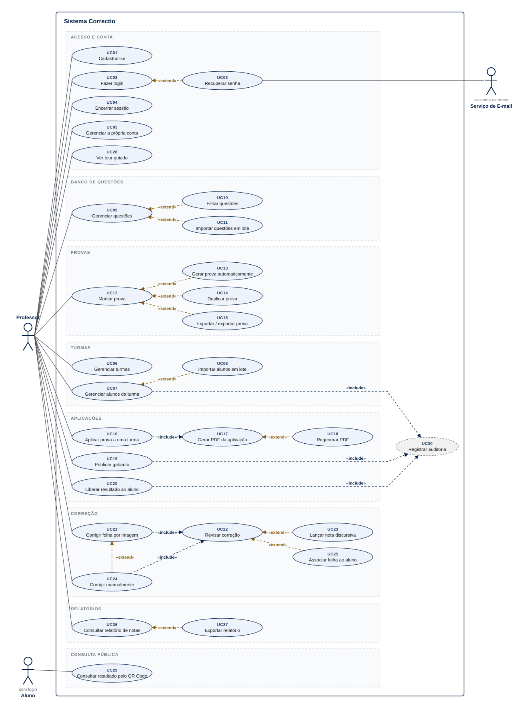
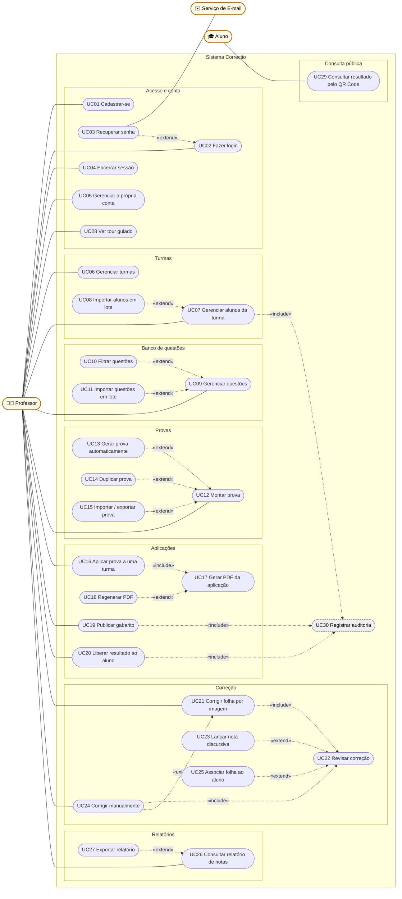

# Diagrama de Caso de Uso — Correctio

> Atividade N2, parte 1 · Projeto e Arquitetura de Software · Grupo 2 · Católica SC
>
> Fonte dos requisitos: [Principais_Requisitos_Correctio.md](../Principais_Requisitos_Correctio.md)
> (RF01 a RF48). Se um requisito mudar lá, este diagrama precisa ser revisto.

O diagrama de caso de uso responde a uma pergunta só: **quem usa o sistema e para fazer o
quê**. Ele não mostra telas, ordem dos passos nem como o sistema funciona por dentro — isso
fica para os diagramas de atividade, de sequência e de classe.

---

## Passo 1 — Definir a fronteira do sistema

Primeiro, decidir o que está **dentro** do Correctio e o que está **fora** dele. Tudo dentro
da fronteira é responsabilidade do sistema; tudo fora é ator.

| Dentro do sistema                          | Fora do sistema                    |
| ------------------------------------------ | ---------------------------------- |
| Cadastro e login do professor              | O professor e o aluno (pessoas)    |
| Turmas, alunos, banco de questões, provas  | O serviço que entrega e-mail       |
| Geração do PDF com QR Code                 | A impressora e o papel             |
| Leitura da foto da folha e cálculo da nota | A câmera do celular                |
| Relatórios e página pública de resultado   | O sistema acadêmico da instituição |

**Por que a impressora e a câmera não viram atores:** o sistema não conversa com elas. Ele
entrega um PDF e recebe uma imagem; quem imprime e fotografa é o professor.

---

## Passo 2 — Identificar os atores

Ator é **um papel** que interage com o sistema, não uma pessoa específica. A pergunta para
encontrar cada um: *quem inicia uma ação, ou quem o sistema precisa acionar?*

| Ator                  | Tipo       | Quem é                                       | Como interage                                                                       |
| --------------------- | ---------- | -------------------------------------------- | ----------------------------------------------------------------------------------- |
| **Professor**         | Primário   | Único usuário com login                      | Faz praticamente tudo: turmas, questões, provas, aplicações, correções e relatórios |
| **Aluno**             | Primário   | Não tem conta; é um registro dentro da turma | Escaneia o QR Code da própria folha e vê o resultado em uma página pública          |
| **Serviço de E-mail** | Secundário | Sistema externo                              | É acionado pelo Correctio para entregar o link de recuperação de senha              |

Atores primários **iniciam** casos de uso; o secundário **é acionado** pelo sistema para
completar um deles. Por isso o Professor e o Aluno ficam à esquerda do diagrama e o Serviço de
E-mail à direita.

### Atores descartados, e por quê

| Candidato                 | Por que não entrou                                                                       |
| ------------------------- | ---------------------------------------------------------------------------------------- |
| Administrador             | Não existe no escopo: nenhum RF descreve um papel acima do professor.                    |
| Aluno com login           | A área do aluno está fora do escopo. O aluno só consulta pelo QR Code, sem conta (RF33). |
| Coordenador / instituição | Recebe relatórios exportados, mas não usa o sistema (RF36 é ação do professor).          |
| Leitor de QR / OCR        | É parte interna do sistema, não algo externo a ele.                                      |

---

## Passo 3 — Levantar os casos de uso a partir dos requisitos

Cada caso de uso é **um objetivo completo do ator**, nomeado com verbo no infinitivo
("Montar prova", não "Tela de prova" nem "Clicar em salvar"). O teste: *o ator ficaria
satisfeito se só isso acontecesse?*

Vários RFs viram um caso de uso só quando são partes do mesmo objetivo — criar, editar e
arquivar turma são o objetivo "Gerenciar turmas".

| UC   | Caso de uso                      | Ator                         | RFs                    |
| ---- | -------------------------------- | ---------------------------- | ---------------------- |
| UC01 | Cadastrar-se                     | Professor                    | RF01, RF39             |
| UC02 | Fazer login                      | Professor                    | RF02                   |
| UC03 | Recuperar senha                  | Professor, Serviço de E-mail | RF03                   |
| UC04 | Encerrar sessão                  | Professor                    | RF04                   |
| UC05 | Gerenciar a própria conta        | Professor                    | RF05                   |
| UC06 | Gerenciar turmas                 | Professor                    | RF06, RF42             |
| UC07 | Gerenciar alunos da turma        | Professor                    | RF07, RF09, RF38       |
| UC08 | Importar alunos em lote          | Professor                    | RF08                   |
| UC09 | Gerenciar questões               | Professor                    | RF10, RF11, RF42, RF45 |
| UC10 | Filtrar questões                 | Professor                    | RF12                   |
| UC11 | Importar questões em lote        | Professor                    | RF14                   |
| UC12 | Montar prova                     | Professor                    | RF13, RF15, RF17, RF20 |
| UC13 | Gerar prova automaticamente      | Professor                    | RF16                   |
| UC14 | Duplicar prova                   | Professor                    | RF18                   |
| UC15 | Importar / exportar prova        | Professor                    | RF19                   |
| UC16 | Aplicar prova a uma turma        | Professor                    | RF21                   |
| UC17 | Gerar PDF da aplicação           | Professor                    | RF22, RF23, RF43, RF44 |
| UC18 | Regenerar PDF                    | Professor                    | RF24                   |
| UC19 | Publicar gabarito                | Professor                    | RF25                   |
| UC20 | Liberar resultado ao aluno       | Professor                    | RF46                   |
| UC21 | Corrigir folha por imagem        | Professor                    | RF26, RF27, RF32, RF47 |
| UC22 | Revisar correção                 | Professor                    | RF28, RF48             |
| UC23 | Lançar nota discursiva           | Professor                    | RF29, RF47             |
| UC24 | Corrigir manualmente             | Professor                    | RF30                   |
| UC25 | Associar folha ao aluno          | Professor                    | RF31                   |
| UC26 | Consultar relatório de notas     | Professor                    | RF34, RF35             |
| UC27 | Exportar relatório               | Professor                    | RF36                   |
| UC28 | Ver tour guiado                  | Professor                    | RF37                   |
| UC29 | Consultar resultado pelo QR Code | Aluno                        | RF33                   |
| UC30 | Registrar auditoria              | *(interno)*                  | RF40                   |

### Requisitos que não viraram caso de uso

| RF                               | Por que não                                                                                                                    |
| -------------------------------- | ------------------------------------------------------------------------------------------------------------------------------ |
| RF39 — aviso de privacidade      | É um passo dentro de UC01 e UC08, não um objetivo do professor.                                                                |
| RF41 — operação em segundo plano | Descreve **como** o sistema responde, não **o que** o ator quer. É comportamento, fica nos diagramas de atividade e sequência. |
| RF43, RF44 — paginação do PDF    | Regras de UC17. Aparecem na especificação dele, não como caso de uso.                                                          |
| RNF01 a RNF20                    | Requisitos não funcionais nunca viram caso de uso.                                                                             |

---

## Passo 4 — Agrupar em módulos

Com 30 casos de uso, o diagrama fica ilegível se tudo estiver solto. Agrupar pelo módulo do
sistema (o mesmo das telas) deixa claro onde cada um mora:

| Módulo            | Casos de uso      |
| ----------------- | ----------------- |
| Acesso e conta    | UC01 a UC05, UC28 |
| Turmas            | UC06 a UC08       |
| Banco de questões | UC09 a UC11       |
| Provas            | UC12 a UC15       |
| Aplicações        | UC16 a UC20       |
| Correção          | UC21 a UC25       |
| Relatórios        | UC26, UC27        |
| Consulta pública  | UC29              |

---

## Passo 5 — Definir os relacionamentos

São três tipos de ligação, e a escolha entre eles é a parte que mais gera dúvida:

| Relação        | Significado                                            | Seta                                   | Teste rápido                                        |
| -------------- | ------------------------------------------------------ | -------------------------------------- | --------------------------------------------------- |
| **Associação** | O ator participa do caso de uso                        | linha cheia ator → UC                  | O ator inicia ou é acionado?                        |
| **«include»**  | O caso base **sempre** executa o incluído              | tracejada, **da base para o incluído** | Dá para terminar a base sem ele? Se não, é include. |
| **«extend»**   | O caso estendido **às vezes** acrescenta comportamento | tracejada, **da extensão para a base** | É opcional ou depende de condição? Então é extend.  |

### Relacionamentos escolhidos

| De                           | Relação   | Para                     | Justificativa                                                            |
| ---------------------------- | --------- | ------------------------ | ------------------------------------------------------------------------ |
| UC03 Recuperar senha         | «extend»  | UC02 Fazer login         | Só acontece quando o professor esqueceu a senha.                         |
| UC08 Importar alunos         | «extend»  | UC07 Gerenciar alunos    | Alternativa opcional ao cadastro um a um.                                |
| UC07 Gerenciar alunos        | «include» | UC30 Registrar auditoria | Toda operação sobre dado pessoal de aluno é auditada (RF40).             |
| UC10 Filtrar questões        | «extend»  | UC09 Gerenciar questões  | Filtrar é opcional ao navegar no banco.                                  |
| UC11 Importar questões       | «extend»  | UC09 Gerenciar questões  | Alternativa opcional ao cadastro uma a uma.                              |
| UC13 Gerar automaticamente   | «extend»  | UC12 Montar prova        | Outra forma de montar, escolhida pelo professor.                         |
| UC14 Duplicar prova          | «extend»  | UC12 Montar prova        | Parte de uma prova existente em vez de começar do zero.                  |
| UC15 Importar / exportar     | «extend»  | UC12 Montar prova        | Opcional.                                                                |
| UC16 Aplicar prova           | «include» | UC17 Gerar PDF           | Aplicação existe para ser impressa: sem PDF, não há folha para corrigir. |
| UC18 Regenerar PDF           | «extend»  | UC17 Gerar PDF           | Só enquanto não há correção confirmada (RF24).                           |
| UC19 Publicar gabarito       | «include» | UC30 Registrar auditoria | Exigido pelo RF40.                                                       |
| UC20 Liberar resultado       | «include» | UC30 Registrar auditoria | Exigido pelo RF40.                                                       |
| UC21 Corrigir por imagem     | «include» | UC22 Revisar correção    | Nenhuma leitura vira nota sem confirmação do professor.                  |
| UC24 Corrigir manualmente    | «include» | UC22 Revisar correção    | A correção manual também passa pela tela de revisão antes de confirmar.  |
| UC24 Corrigir manualmente    | «extend»  | UC21 Corrigir por imagem | Usada quando a leitura da imagem falha (RF30).                           |
| UC23 Lançar nota discursiva  | «extend»  | UC22 Revisar correção    | Só quando a prova tem questão discursiva (RF47).                         |
| UC25 Associar folha ao aluno | «extend»  | UC22 Revisar correção    | Só quando a prova foi impressa sem identificação (RF31).                 |
| UC27 Exportar relatório      | «extend»  | UC26 Consultar relatório | Opcional.                                                                |

**Por que UC30 não tem ator:** "Registrar auditoria" é feito pelo sistema, nunca pedido
pelo professor. Ele só existe como caso incluído — desenhá-lo deixa visível no diagrama que
as operações sensíveis de LGPD são sempre registradas.

**Por que UC29 depende de UC20 mas não tem seta:** a página pública só mostra o resultado
depois da liberação, mas isso é uma **pré-condição** (ordem no tempo), não include nem
extend. Ordem no tempo fica para o diagrama de atividade.

---

## Passo 6 — Desenhar o diagrama

Convenções usadas no desenho:

- o retângulo externo é a fronteira do sistema **Correctio**;
- cada caixa interna tracejada é um módulo do Passo 4;
- elipses são casos de uso; atores ficam fora da fronteira;
- linha cheia é associação; linha tracejada rotulada é «include» ou «extend».

Mesmo diagrama em Mermaid (texto editável)

> A imagem acima é a versão oficial: notação UML com bonecos de ator, «include» em azul e
> «extend» em dourado. O Mermaid não tem um tipo nativo de caso de uso, por isso a versão em
> texto usa um fluxograma com elipses. O mesmo conteúdo está em PlantUML no apêndice.

---

## Passo 7 — Especificar os casos de uso principais

O diagrama mostra **que** o caso existe; a especificação mostra **o que acontece** nele.
Detalhamos os dois casos centrais do produto — o que mais gera valor (corrigir) e o único
que envolve o aluno.

### UC21 — Corrigir folha por imagem

| Campo              | Conteúdo                                                                                                          |
| ------------------ | ----------------------------------------------------------------------------------------------------------------- |
| **Ator principal** | Professor                                                                                                         |
| **Objetivo**       | Obter a nota de uma folha de respostas a partir de uma foto ou scan.                                              |
| **Pré-condições**  | Professor autenticado; existe uma aplicação com PDF gerado (UC17).                                                |
| **Pós-condição**   | Correção salva com a alternativa marcada em cada questão, acerto/erro, nota por questão e origem "imagem" (RF32). |
| **RFs**            | RF26, RF27, RF32, RF47                                                                                            |

**Fluxo principal**

1. O professor abre a aplicação e escolhe corrigir.
2. O professor envia uma ou várias imagens de folhas (RF26).
3. O sistema confirma o recebimento e processa em segundo plano (RF41).
4. O sistema lê o QR Code e identifica folha, versão e, se houver, aluno.
5. O sistema lê as marcações e compara com o gabarito daquela versão (RF27).
6. O sistema calcula a nota das questões objetivas.
7. Inclui **UC22 Revisar correção**: o professor confere e confirma.
8. O sistema salva a correção como concluída.

**Fluxos alternativos**

- **4a. QR Code ilegível ou inválido** → o sistema avisa; o professor segue por **UC24
  Corrigir manualmente** (extend).
- **6a. A prova tem discursivas** → a correção fica "em andamento" até o professor executar
  **UC23 Lançar nota discursiva** (RF47, RF48).
- **4b. Prova sem identificação do aluno** → a correção fica ligada à folha; o professor pode
  executar **UC25 Associar folha ao aluno** (RF31).
- **8a. Já existe correção confirmada para o mesmo aluno na mesma versão** → o sistema
  sinaliza o conflito e não sobrescreve a anterior.

### UC29 — Consultar resultado pelo QR Code

| Campo              | Conteúdo                                                             |
| ------------------ | -------------------------------------------------------------------- |
| **Ator principal** | Aluno (sem login)                                                    |
| **Objetivo**       | Ver o gabarito e, se liberado, a própria nota.                       |
| **Pré-condições**  | O professor publicou o gabarito (UC19) e liberou o resultado (UC20). |
| **Pós-condição**   | Nenhuma alteração no sistema; é só leitura.                          |
| **RFs**            | RF33, RF46                                                           |

**Fluxo principal**

1. O aluno escaneia o QR Code impresso na própria folha.
2. O sistema abre a página pública daquela folha.
3. O sistema valida o código de consulta.
4. O sistema mostra o gabarito e, se o professor escolheu, a nota (RF46).

**Fluxos alternativos**

- **3a. Código inválido ou de PDF regenerado** → o sistema mostra "QR inválido", nunca a
  nota antiga (RF24).
- **3b. Resultado ainda não liberado** → o sistema informa que o resultado ainda não está
  disponível.
- **3c. Muitas tentativas do mesmo IP** → o sistema bloqueia temporariamente (limite de 30
  requisições por minuto, ver [Seguranca_e_LGPD.md](../Seguranca_e_LGPD.md)).

---

## Passo 8 — Revisar o diagrama

Checklist usado para conferir o resultado antes de fechar:

- [x] Todo RF funcional está em algum caso de uso ou justificado no Passo 3.
- [x] Todo caso de uso tem nome com verbo no infinitivo e representa um objetivo do ator.
- [x] Nenhum caso de uso é uma tela, um botão ou um passo técnico.
- [x] Todo caso de uso está ligado a um ator, direta ou indiretamente (por include/extend) —
      a exceção é UC30, que é interno e só aparece incluído.
- [x] Setas de «include» saem da base; setas de «extend» saem da extensão.
- [x] Nenhum ator está dentro da fronteira do sistema.
- [x] Não existe ator para o que está fora do escopo (área do aluno, administrador).

---

## Apêndice — Versão em PlantUML

Para gerar a imagem na notação UML clássica (bonecos de ator, elipses), cole o código abaixo
em [plantuml.com/plantuml](https://www.plantuml.com/plantuml) ou use a extensão PlantUML do
VS Code.

```plantuml
@startuml Correctio_Casos_de_Uso
left to right direction
skinparam packageStyle rectangle
skinparam actorStyle awesome

actor "Professor" as professor
actor "Aluno" as aluno
actor "Serviço de E-mail" as email <<sistema>>

rectangle "Sistema Correctio" {

  package "Acesso e conta" {
    usecase "UC01 Cadastrar-se" as UC01
    usecase "UC02 Fazer login" as UC02
    usecase "UC03 Recuperar senha" as UC03
    usecase "UC04 Encerrar sessão" as UC04
    usecase "UC05 Gerenciar a própria conta" as UC05
    usecase "UC28 Ver tour guiado" as UC28
  }

  package "Turmas" {
    usecase "UC06 Gerenciar turmas" as UC06
    usecase "UC07 Gerenciar alunos da turma" as UC07
    usecase "UC08 Importar alunos em lote" as UC08
  }

  package "Banco de questões" {
    usecase "UC09 Gerenciar questões" as UC09
    usecase "UC10 Filtrar questões" as UC10
    usecase "UC11 Importar questões em lote" as UC11
  }

  package "Provas" {
    usecase "UC12 Montar prova" as UC12
    usecase "UC13 Gerar prova automaticamente" as UC13
    usecase "UC14 Duplicar prova" as UC14
    usecase "UC15 Importar / exportar prova" as UC15
  }

  package "Aplicações" {
    usecase "UC16 Aplicar prova a uma turma" as UC16
    usecase "UC17 Gerar PDF da aplicação" as UC17
    usecase "UC18 Regenerar PDF" as UC18
    usecase "UC19 Publicar gabarito" as UC19
    usecase "UC20 Liberar resultado ao aluno" as UC20
  }

  package "Correção" {
    usecase "UC21 Corrigir folha por imagem" as UC21
    usecase "UC22 Revisar correção" as UC22
    usecase "UC23 Lançar nota discursiva" as UC23
    usecase "UC24 Corrigir manualmente" as UC24
    usecase "UC25 Associar folha ao aluno" as UC25
  }

  package "Relatórios" {
    usecase "UC26 Consultar relatório de notas" as UC26
    usecase "UC27 Exportar relatório" as UC27
  }

  package "Consulta pública" {
    usecase "UC29 Consultar resultado pelo QR Code" as UC29
  }

  usecase "UC30 Registrar auditoria" as UC30
}

professor --> UC01
professor --> UC02
professor --> UC04
professor --> UC05
professor --> UC28
professor --> UC06
professor --> UC07
professor --> UC09
professor --> UC12
professor --> UC16
professor --> UC19
professor --> UC20
professor --> UC21
professor --> UC24
professor --> UC26
aluno --> UC29
UC03 --> email

UC03 .> UC02 : <<extend>>
UC08 .> UC07 : <<extend>>
UC07 .> UC30 : <<include>>
UC10 .> UC09 : <<extend>>
UC11 .> UC09 : <<extend>>
UC13 .> UC12 : <<extend>>
UC14 .> UC12 : <<extend>>
UC15 .> UC12 : <<extend>>
UC16 .> UC17 : <<include>>
UC18 .> UC17 : <<extend>>
UC19 .> UC30 : <<include>>
UC20 .> UC30 : <<include>>
UC21 .> UC22 : <<include>>
UC24 .> UC22 : <<include>>
UC24 .> UC21 : <<extend>>
UC23 .> UC22 : <<extend>>
UC25 .> UC22 : <<extend>>
UC27 .> UC26 : <<extend>>
@enduml
```

